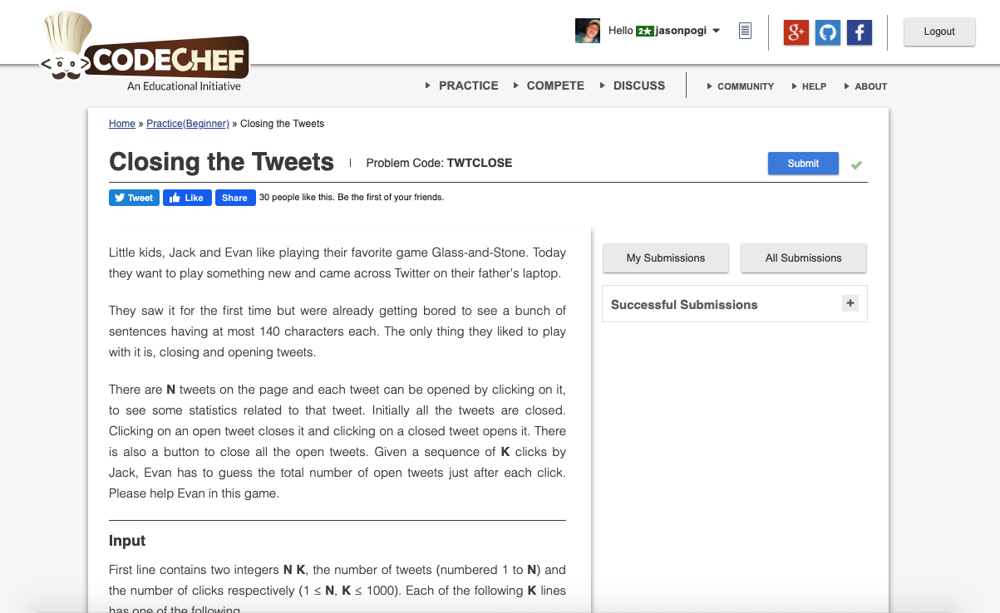

# Codechef-Closing-the-Tweets
### Problem

### Program Simulation
<pre>
  Sample Input:
  3 6
  CLICK 1
  CLICK 2
  CLICK 3
  CLICK 2
  CLOSEALL
  CLICK 1

  bool p [n] = {false}
  input "CLICK"
  "CLOSEALL" condition // false
  input "1"
  t = 1
  p[t - 1] == true condition // false
  p[0] = true
  cnt++
  cnt = 1

  input "CLICK"
  "CLOSEALL" condition // false
  input "2"
  t = 2
  p[t - 1] == true condition // false
  p[1] = true
  cnt++
  cnt = 2

  input "CLICK"
  "CLOSEALL" condition // false
  input "3"
  t = 3
  p[t - 1] == true condition // false
  p[2] = true
  cnt++
  cnt = 3

  input "CLICK"
  "CLOSEALL" condition // false
  input "2
  t = 2
  p[t - 1] == true // true
  p[t - 1] = false
  cnt--
  cnt = 2

  input "CLOSEALL"
  "CLOSEALL" condition // true
  cnt = 0
  p[0] = false, p[1] = false, p[2] = false

  input "CLICK"
  "CLOSEALL" condition // false
  t = 1
  p[t - 1] == true // false
  p[0] = true
  cnt++
  cnt = 1

  Final Output:
  1
  2
  3
  2
  0
  1
</pre>
